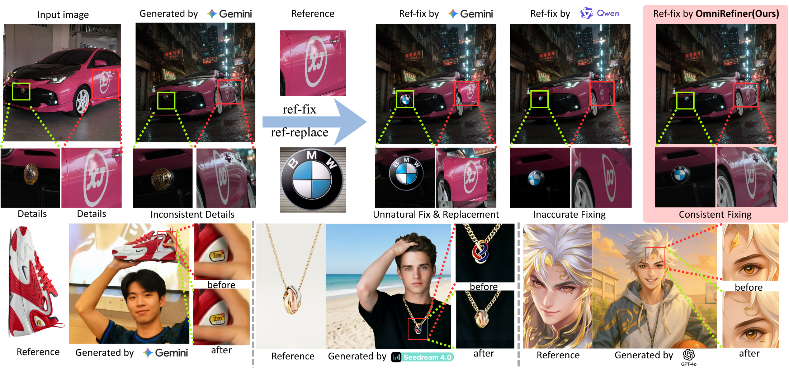
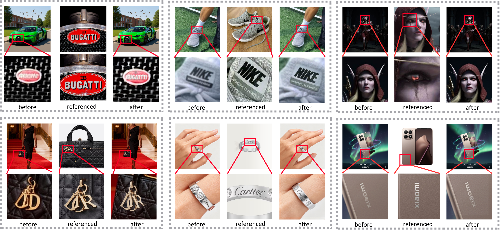
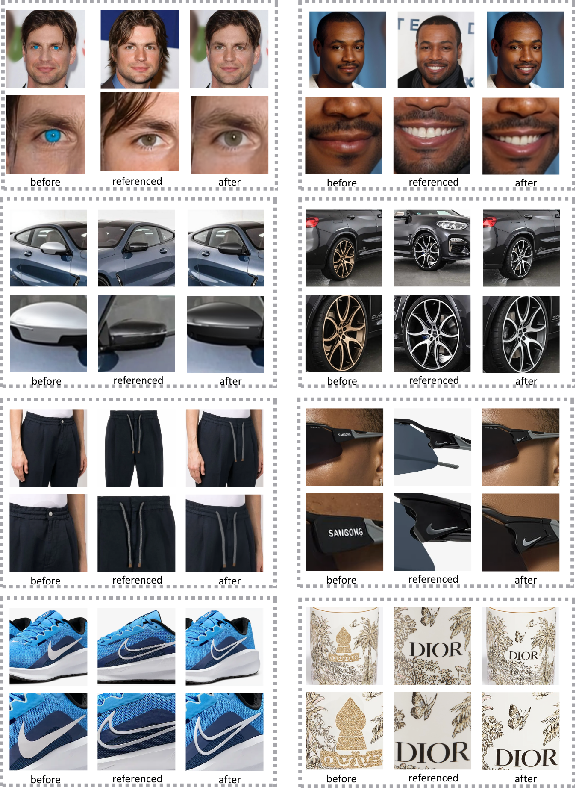

<h1>OmniRefiner: Reinforcement-Guided Local Diffusion Refinement</h1>

<!-- 
 -->

---

## 👥 Authors
>Yaoli Liu1,4, Ziheng Ouyang2, Shengtao Lou4 and Yiren Song3,4.
> 
> 1 Zhejiang University
> 2 Nankai University
> 3 National University of Singapore
> 4 Creatly.ai
> 

---

<text>Qualitative results demonstrate that our method can accurately restore fine details in images.</text>

<text>Compared with the state-of-the-art multi-image editing methods, our approach achieves not only faithful reconstruction of the original image in reference–repair tasks, but also excellent performance in various reconstruction scenarios including text, patterns, facial details, and object details. In contrast, existing methods often fail to remain faithful to the original image during repair or are unable to recover text and fine details.</text>

<text>Additional restoration results show that our method is highly effective in both detail-guided refinement and detail-guided replacement.</text>

  
